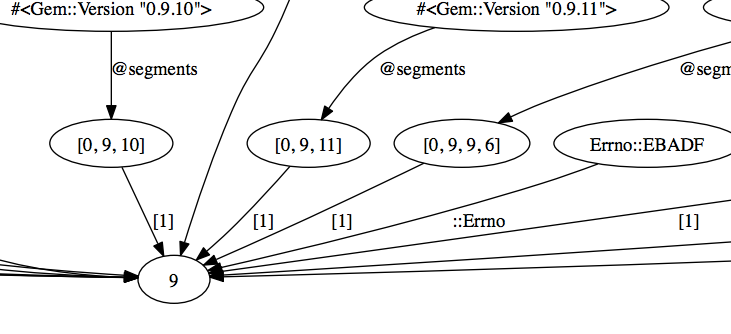

Memory leaks are my least favourite type of bug. To track them down requires not only a detailed knowledge of the entire codebase but also strong intuition (or a lot of luck). To make the process more fun I've written a patch for ruby 1.9.3 that lets you visualize portions of the memory graph.

ObjectSpace.each_object
=======================

Ruby already comes with `ObjectSpace` which contains a few methods for analyzing your program. The most useful for finding memory leaks is `ObjectSpace.each_object` which yields every single ruby object in your program.


counts = Hash.new{ 0 }
ObjectSpace.each_object do |o|
  counts[o.class] += 1
end


By dumping the counts into a file after each request and using `diff` it's possible to determine what kind of objects are leaking. This is essential to know, but it doesn't give you any insight into why they're not being garbage collected.

ObjectSpace.find_references
===========================

The first step in getting more insight is to find everything that references the object that is being leaked. Ruby already knows how to calculate this information, as it's needed for the mark and sweep garbage collection, but it doesn't expose it to ruby code. The patches add a `find_references` method to `ObjectSpace` that returns an array of all objects that reference the object you're looking for.


ObjectSpace.find_references(
  ObjectSpace.each_object(MainController).first
)


This works but it turns out to be far too fiddly for manual use while debugging. The main problem is that every time you run `find_references` the array that is returned adds a whole slew of additional bogus references. This pollutes the reference graph quickly, so you continually have to restart the process to flush these out.

ObjectGraph#view!
=================

The next step is to recursively run `find_references` until you've generated a graph that shows all the ways in which your object is referenced. This is wrapped up by the `ObjectGraph` class, which takes care to avoid the bogus-references problem. The most useful thing this class can do is let you `view!` the graph using graphviz.


require 'object_graph'
ObjectGraph.new(9).view!


While 9 is a silly example it hopefully gives you a feel for how easy it is to reason about the resulting graph. You'll notice that not only is each node labelled with the inspect output for the object, each edge is also labelled in a way that corresponds to how the reference was made. If you need programmatic access to this information then the `annotated_edges` method returns an array of edges along with their description.

Installation
============

My [patches](https://github.com/ConradIrwin/ruby/commits/find-references) add both [`ObjectSpace.find_references`](https://github.com/ConradIrwin/ruby/commit/af5266875503d58b9fd16a6748d71649e69af922) and  a new [`ObjectGraph`](https://github.com/ConradIrwin/ruby/blob/find-references/lib/object_graph.rb) standard library. If you want to use them you can either clone my repository and build the `find-references` branch yourself, or use one of the quick methods below:

Using [rvm](http://rvm.io) with a patch:

curl -L http://git.io/kRIgxw > references.patch
rvm install 1.9.3-p392-ref --patch ./references.patch
rvm use 1.9.3-p392-ref


Using [rbenv](https://github.com/sstephenson/rbenv) with ruby-build:

curl -L http://git.io/4fQ9Jg > 1.9.3-p392-ref
rbenv install ./1.9.3-p392-ref
rbenv shell 1.9.3-p392-ref


Using [chruby](https://github.com/postmodern/chruby) with ruby-build:

curl -L http://git.io/4fQ9Jg > 1.9.3-p392-ref
ruby-build ./1.9.3-p392-ref ~/.rubies/ruby-1.9.3-p392-ref
chruby 1.9.3-p392-ref


To get pretty pictures, you'll also need to `brew install graphviz` or `apt-get install graphviz`.
