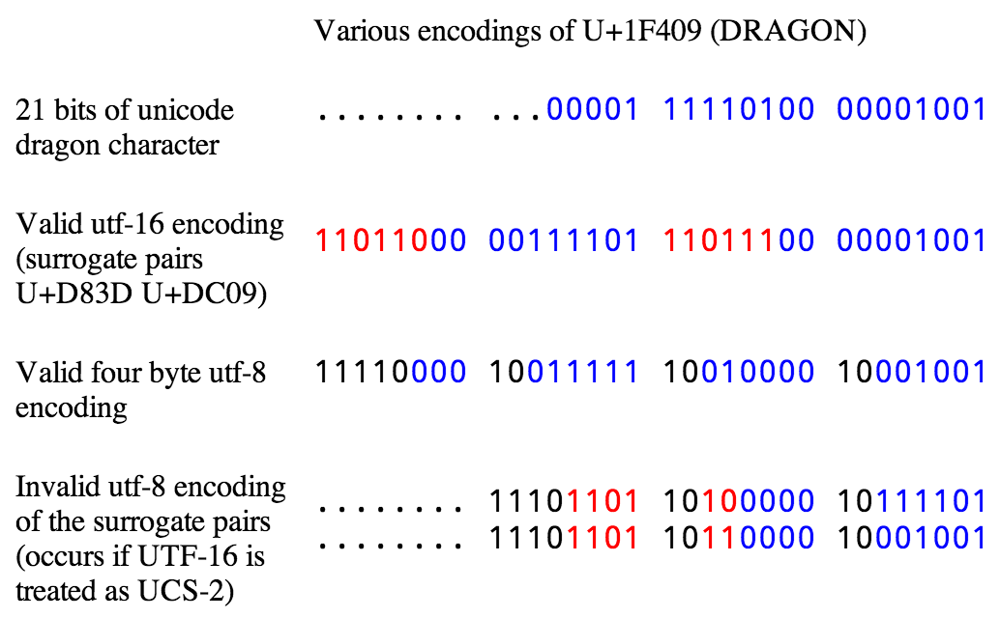

At [Bugsnag](https://bugsnag.com/) we accept JSON payloads of application
crashes. These often contain broken data. For example, if your app has crashed
with an invalid encoding error, the JSON will often contain the invalid string
that crashed your server.

This shouldn't be a problem for us as we read the JSON payload with Node and
Node replaces all the invalid bytes with the unicode replacement character (�
U+FFFD). But something strange was happening:

Sometimes our Rails app would crash due to invalid UTF-8 *after* the Node app
had validated it!

Here, as they say, be dragons...

The problem
===========

In 1991 Unicode 1.0 was published. It defined 12,795 characters and reserved
space for 65,536 in total. To represent these values in memory you use the
character encoding UCS-2, which maps each pair of bytes in RAM directly to the
unicode code-point. This is very simple to implement, particularly compared to
other encodings proposed at the time, and so saw wide-spread adoption.

Five years later Unicode 2.0 came out. It defined 178,500 characters and
reserved space for 1,112,064. This is a lot more than can fit comfortably into
2 bytes. To avoid irritating everyone who had implemented Unicode 1.0, the
consortium came up with a clever backward-compatible encoding called UTF-16.

UTF-16 works by taking an unused portion of the unicode range (U+D800 through
U+DFFF) and marking it as invalid. Unicode strings must never contain code
points in that range. They took these unused code-points (known as surrogates)
and used them in pairs (known as surrogate pairs) to represent the extra
million code-points they wanted. For characters in the range 0x0000 - 0xFFFF,
UTF-16 uses two bytes to represent the code-point exactly like UCS-2. For
characters outside this range UTF-16 uses four bytes, with each pair of bytes
in the range 0xD800 - 0xDFFF.

<figure class="image">
  
</figure>

Unfortunately for us, Javascript has never been updated to support UTF-16.
Instead it continues to treat strings as UCS-2. Most of the time this isn't a
problem, but if your input happens to contain a character in the range 0xD800 -
0xDFFF then Node will erroneously think it is valid Unicode. This isn't a huge
problem in and of itself, but as soon as you want to share data between Node
and anything else, you need to be careful to ensure your Unicode is actually
valid according to the post-1996 definition.

The solution
============

For now the easiest solution is to install the
[unicode-dragon](https://npmjs.org/package/unicode-dragon) module from npm, and
use it to ensure your strings are valid Unicode:


unicodeDragon = require('unicode-dragon');
var validString = unicodeDragon(buffer.toString('utf-8'));


Ideally this problem would be fixed in V8 itself, and I've opened a [bug
report](https://code.google.com/p/v8/issues/detail?id=2875) about it. There may
be valid reasons not to fix this completely, for example it's quite likely that
people are relying on this bug to parse CESU-8, but we'll see what happens.

Caveat emptor
=============

If this bug is fixed in Node, or you use `unicodeDragon`, you still have to be
careful. Any time you modify a string in Javascript you have to be careful not
to chop a UTF-16 character in half. The exceptions that were crashing us were
caused by people using `String.prototype.substr`. That function works perfectly
on strings that only contain Unicode 1.0 data, but as soon as you're storing
UTF-16 in your UCS-2 string there's a possibility that when you take a slice
you'll split a valid surrogate pair into two invalid lonely surrogates.

Almost all javascript String functions have the same problem, but luckily the
standard is slowly beginning to include some [UTF-16 aware
helpers](https://gist.github.com/slevithan/2290602). Hopefully someone will
figure out a nice way to make Javascript Unicode native sooner rather than
later, but until then we'll have to continue being careful.
