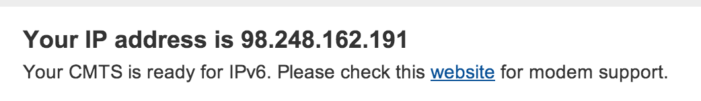
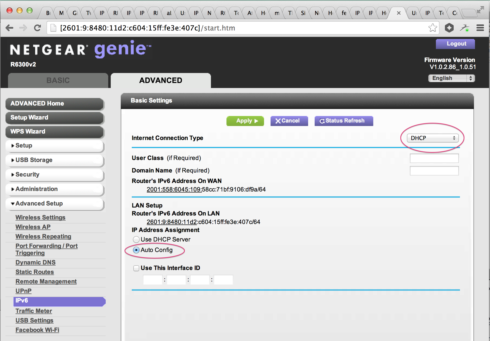
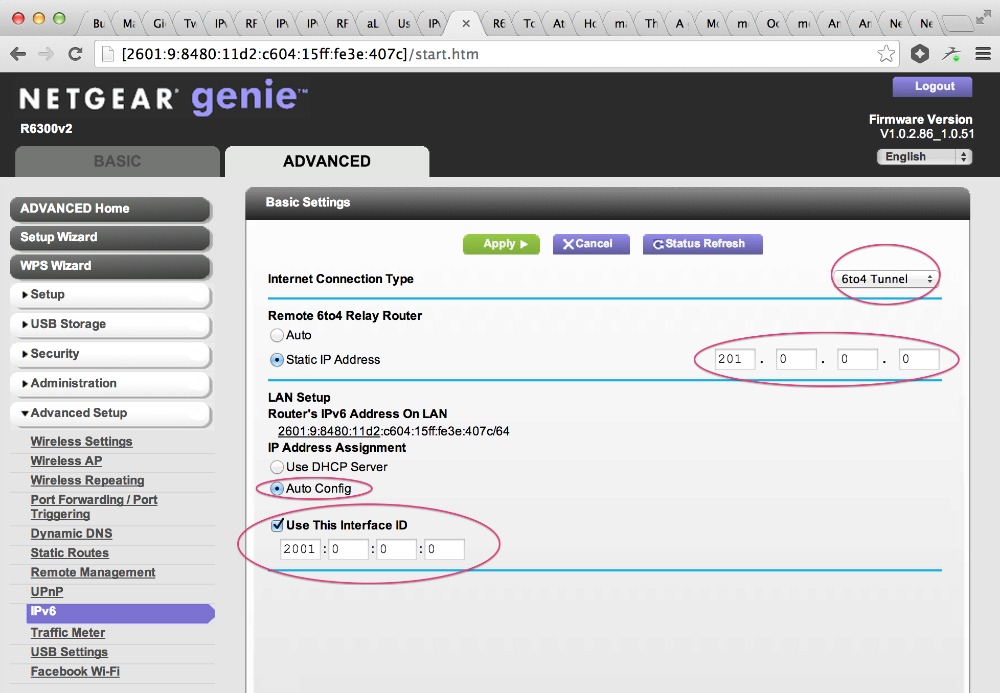

This is a companion article to [IPv6 comes to San Francisco](ipv6) with detailed
instructions for Comcast and Sonic.net.

### Comcast
For Comcast, you can double-check that you have support by visiting
[comcast6.net](http://www.comcast6.net/). If you see "Your <abbr title="Cable
Modem Termination System">CMTS</abbr> is ready for IPv6.", you're ready to
rock!

<figure class="image">
  
</figure>

Then navigate to your router (probably 192.168.1.1 or 192.168.0.1) and
find the IPv6 settings.

There are two questions to be answered: How should the router obtain an
IPv6 address from Comcast? How should devices connected to the network
obtain IPv6 addresses?

The answers are "DHCP" and "Auto config" respectively, as can be seen here:

<figure class="image">
  
</figure>

It takes a few minutes for the DHCP to work the first time. After the router
has an IPv6 address, you also need to reset the wireless connection on your
laptop. (on a Mac you may need to open network settings and click "Forget this
network")

### Sonic.net

Sonic.net is a little more manual to configure. They use IPv6 tunnelling (instead
of IPv6 end-to-end) but there's no difference as far as your laptop is concerned.

There are two questions to be answered: What's the IPv4 address of Sonic.net's IPv6
tunnel? Which IPv6 network prefix have Sonic.net assigned to you?

You can find both of the answers in your Sonic.net account page under Labs /
IPv6. Then configure your router as a 6to4 Tunnel:

<figure class="image">
  
</figure>

Once you've applied these changes to the router, you need to reset the wireless
connection on your laptop. (on a Mac you may need to open network settings and click
"Forget this network")
