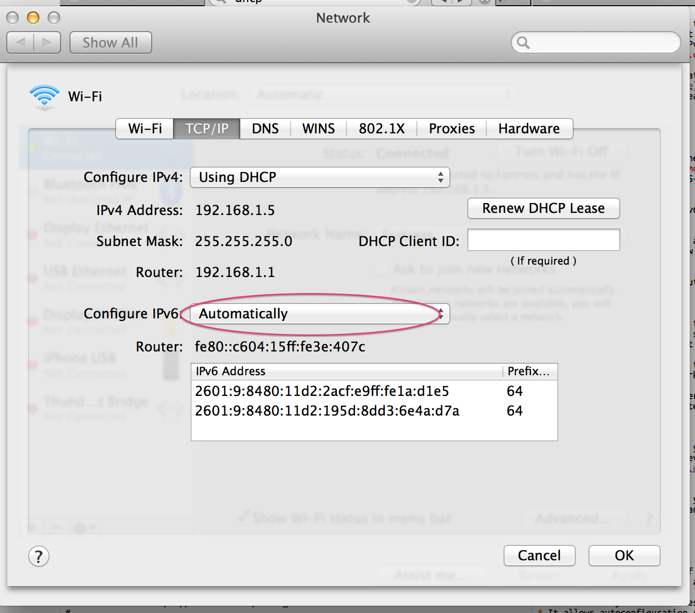

If you live in San Francisco there's a good chance that you can use IPv6 on
your home router. Comcast, AT&T, and Sonic.net all support it. ([let me
know](https://twitter.com/ConradIrwin) if there's one I missed).

It took me a while to get everything set up, so here is a collection of
everything you need to know to move from IPv4 only to IPv4 + IPv6.

It goes without saying that you'll need an IPv6 compatible modem. Almost
all modern equipment should work, and Comcast maintains an [official
list](http://mydeviceinfo.comcast.net/) of what they support. If you need to
upgrade, I have a <a title="Motorola Surfboard 6141 — affiliate link"
href="http://www.amazon.com/gp/product/B00AJHDZSI/ref=as_li_tf_tl?ie=UTF8&camp=1789&creative=9325&creativeASIN=B00AJHDZSI&linkCode=as2&tag=cirwin-20">Motorola
Surfboard 6141</a> and a <a title="Netgear R6300v2 — affiliate link"
href="http://www.amazon.com/gp/product/B00EM5UFP4/ref=as_li_qf_sp_asin_tl?ie=UTF8&camp=1789&creative=9325&creativeASIN=B00EM5UFP4&linkCode=as2&tag=cirwin-20">Netgear
R6300v2</a> that work together flawlessly.

## Configuring IPv6

The configuration instructions got a bit long, so I've put the details of
how to configure IPv6 for [Comcast](ipv6-config#comcast) and
[Sonic.net](ipv6-config#sonic-net) on a separate page.

## Troubleshooting tips

IPv6 is a little confusing if you're used to debugging IPv4 networks.  There's
no <a href="https://en.wikipedia.org/wiki/Network_address_translation"
title="Network Address Translation">NAT</a>, and no <a
href="https://en.wikipedia.org/wiki/Dynamic_Host_Configuration_Protocol"
title="Dynamic Host Configuration Protocol">DHCP</a>, instead devices
automatically assign themselves [multiple addresses](#multiple-addresses).

If you open [test-ipv6.com](http://test-ipv6.com/), it will hopefully show you
that you are connected to IPv6 and that everything works. If not, there are two
scenarios to consider:

1. Everything's working, but only on IPv4. In this case your laptop is not
   trying to use IPv6. Double check that the router has an IPv6 address, and
   that your laptop is configured to use it automatically. You should turn
   your laptop's Wifi off and on again after everything has been configured.

    <figure class="image">
    
    </figure>

2. Things are broken. This means that your laptop is using IPv6, but your
   connection isn't. This usually implies that the router is using IPv6
   correctly on the <a href="https://en.wikipedia.org/wiki/Local_area_network"
   title="Local area network — Your personal wifi">LAN</a>, but the <a
   href="https://en.wikipedia.org/wiki/Wide_area_network" title="Wide area
   network — Your connection to Comcast">WAN</a> IPv6 is mis-configured.
   Hopefully your router will have a readable status page where you can see
   what it thinks is going on, or [ask for
   help](https://twitter.com/ConradIrwin).

## What are all these addresses?

The most confusing thing I found about IPv6 is that every device gets many IPv6
addresses.

At a minimum every adaptor automatically gets a <a
href="http://en.wikipedia.org/wiki/Link-local_address#IPv6">link-local
address</a> that is based on its
<a href="http://en.wikipedia.org/wiki/MAC_address">MAC address</a>. These can't be used for
anything (you can't even `ping6` them) but they appear in routing tables (`netstat -nr`).

    # On my network, there are three of these.
    fe80::2acf:e9ff:fe1a:d1e5 # laptop wifi
    fe80::2acf:e9ff:fe1a:d1e6 # laptop wired
    fe80::c604:15ff:fe3e:407c # router LAN

Adaptors connected to the internet also
[obtain](http://en.wikipedia.org/wiki/IPv6_address#Stateless_address_autoconfiguration)
one or two globally unique IPv6 addresses. These all share the address prefix that Comcast
has assigned to my network (`2601:9:8480:11d2::/64`), and they can actually be used (you
can `ping6` them).

    2601:9:8480:11d2:2acf:e9ff:fe1a:d1e5  # laptop, MAC-address autoconfig
    2601:9:8480:11d2:195d:8dd3:6e4a:d7a   # laptop, random autoconfig
    2601:9:8480:11d2:486f:6805:63c7:fe4a  # router LAN, random autoconfig
    2001:558:6045:109:58cc:71bf:9106:df9a # router WAN, comcast-provided

Because there's no NAT in IPv6, when I visit
[whatismyv6.com](http://whatismyv6.com) I actually see
`2601:9:8480:11d2:195d:8dd3:6e4a:d7a` which is the random autoconfig address of
my laptop. If you're used to IPv4 + NAT, you might expect to see the WAN address
of the router, but that is not the case anymore.

## IPv6 tools

In addition to [ipv6-test.com](http://ipv6-test.com) and
[whatismyv6.com](http://whatismyv6.com), there are an array of local tools you can use:

* `ping6` It's just like ping, but for IPv6.

* `curl` works as expected (http requires square brackets around IPv6
  addresses) but you need to pass -g and use single quotes to avoid shell shenanigans

      curl -L -g 'http://[2a03:2880:2110:df07:face:b00c:0000:0001]/'

* `ifconfig`. Prints out all your IPv6 addresses, and IPv4 address too.

* `netstat -nr`. Prints out the routing table so you can see which packets are
  being sent where.

* `ndp -a`. Finds all IPv6 addresses on your LAN (equivalent to `arp -a` in IPv4)

## Feedback, or questions?

If you've got feedback on this post, or need a hand getting IPv6 working, [let
me know](https://twitter.com/ConradIrwin).
