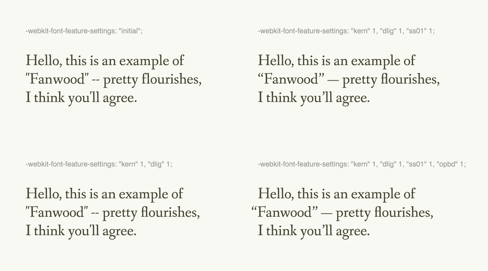

<figure class="image">
  
  
</figure>

I've recently been doing some work on making [Superhuman](http://superhuman.com) the most beautiful email client in the world. (N.B. We're looking to hire a lead designer, please [email me](mailto:conrad@superhuman.com)).

One of the features we wanted was automatic &ldquo;smart quotes&rdquo;. Instead of the bland vertical quotes you often see on a computer "&bull;", we'd replace them at render time by fun curvy quotes &ldquo;&bull;&rdquo; to make the text more alive.

I'd known for a while that [OpenType](https://en.wikipedia.org/wiki/OpenType) was capable of some processing during font rendering, and so I set myself the challenge of implementing smart quotes in the font file itself. To cut a long-story short: [it works](/etc/fanwood), and it's easy to modify an existing font to support it.

font-feature-settings
=====================

The first trick to getting fancy font features working on the web is to set up your [`font-feature-settings`](https://developer.mozilla.org/en-US/docs/Web/CSS/font-feature-settings) CSS property (actually `-webkit-font-feature-settings` or `-moz-font-feature-settings`). This also works in IE 10+, but surprisingly, is not available in Safari.


body {
  font-feature-settings: "kern" 1, "dlig" 1;
  -webkit-font-feature-settings: "kern" 1, "dlig" 1;
  -moz-font-feature-settings: "kern" 1, "dlig" 1;
}


The value of this property is a list of quoted four-letter [OpenType features](https://en.wikipedia.org/wiki/List_of_typographic_features) followed by a number for its value.

The most essential feature to enable is `"kern"`, which enables proper kerning. It's also nice to enable `"liga"` and `"dlig"` which control the use of ligatures. Hover over the following image and notice how the ugly space between the `nw` of [Fanwood](https://www.theleagueofmoveabletype.com/fanwood) is tightened, and how the messy `fl` is replaced by a ligature.

<figure class="image">
  
  <a href="../images/fanwood.png">
    

  </a>
</figure>

Smart quotes
============

Under the hood each OpenType feature is a set of pattern matches: when a certain sequence of glyphs occurs you can `sub`stitute a new glyph into place, or change its `pos`ition. The [OpenType Cookbook](http://opentypecookbook.com/index.html) is a good reference for the syntax used, which is supported by most font editing tools and processed by the [ADFKO](https://github.com/adobe-type-tools/afdko).

The patterns are very simple, but you can use a few techniques to implement surprisingly complicated substitutions.

1. You can specify an `ignore` rule to skip a rule.
2. You can define character classes to group characters together.
3. (I haven't needed this yet) You can group rules into lookups, where only one rule from each lookup is used.

<aside>Exercise for the reader: I think this makes an OpenType font a finite-state machine, anyone fancy implementing arbitrary regexes?</aside>

Starting small, we can implement a simple rule to replace exactly two hyphens (--) by an em-dash (—):


# ignore two hyphens followed by a third hyphen
ignore sub hyphen' hyphen' hyphen;
# and ignore two hyphens preceded by a hyphen
ignore sub hyphen hyphen' hyphen';
# replace all remaining hyphens by em-dashes
sub hyphen' hyphen' by emdash;


To implement smart-quotes we need to be able to tell if a quote is at the start of a line. We can approximate this by defining the character class `@All` which contains all the glyphs in the font, and then using `@All` to catch any quotes that happen after a character. Quotes that don't happen after any character are at the start of a line.


# smart-quotes.
# quotes surrounded by spaces, just leave alone.
ignore sub space quotedbl' space;
# quotes after numers, assume are primes, and leave alone.
ignore sub [
  one two three four five six seven eight nine zero
] quotedbl';
# quotes after opening characters are open-quotes.
sub [space
     equal
     less
     parenleft parenleft.u
     bracketleft bracketleft.u
     braceleft braceleft.u
     guillemotleft guillemotleft.u
     guilsinglleft guilsinglleft.u
     quotedblleft quoteleft quotesingle quotedbl
] quotedbl' @All by quotedblleft;
# other quotes in the middle of the line are closing quotes.
sub @All quotedbl' by quotedblright;
# quotes at the start of the line are opening.
sub quotedbl' @All by quotedblleft;


Because there was no pre-defined OpenType feature name for smart
quotes, I've added it to the font as `"ss01"` or Stylistic Set 1.
You can see the effects of [the full
code](https://gist.github.com/ConradIrwin/d78c9895c0989d143a4d#file-smartquotes-fea)
by hovering below:

<figure class="image">
  
  <a href="../images/fanwood.png">
    

  </a>
</figure>

Hanging punctuation
===================

Inspired by [Typeset](https://blot.im/typeset/), I wanted to see if I could also implement [hanging punctuation](https://en.wikipedia.org/wiki/Hanging_punctuation). This gives the left-margin a strong vertical line by having punctuation marks extend beyond it. Once I had the substitution rules and the character classes set up for the smart quotes, this turned out to be simple:


# feature "opbd"
ignore pos @All quotedblleft';
pos quotedblleft' <-421 0 -421 0>;

ignore pos @All quoteleft';
pos quoteleft' <-228 0 -228 0>;


The positioning rules move the left and right of the glyph independently. The number `421` comes from looking at the glyph for a curvy left quote and taking its width including some spacing. I only needed to look at the curly left-quote, because the `"opbd"` feature is defined after `"ss01"` and so all the plain quotes have already been replaced at this point.

This technique only works for punctuation on the left, but as most text on-screen is set with a ragged right margin, you don't normally need punctuation that hangs out to the right.

More work could be done, Typeset moves &ldquo;Y&rdquo;s, &ldquo;V&rdquo;s and &ldquo;W&rdquo;s out a little too, but this served as a proof of concept.

<figure class="image">
  
  <a href="../images/fanwood.png">
    

  </a>
</figure>

Conclusion
==========

Implementing smart-quotes in your font is totally feasible. It's not as good as using the correct glyphs in the first place, but it's on-par with doing it in Javascript and a lot more convenient (there's no code to run).

You can download my hacked version of [Fanwood Text](https://github.com/ConradIrwin/fanwood) from GitHub, or [preview it](/etc/fanwood). I used [Glyphs](https://glyphsapp.com) to open the existing Fanwood font and add a new feature. If you use a different app, I'm sure you can re-use the syntax, but the UI might be more or less confusing.

If you're still reading and would like to chat about fonts, or work on a beautiful email client, please [email me](mailto:conrad@superhuman.com).

